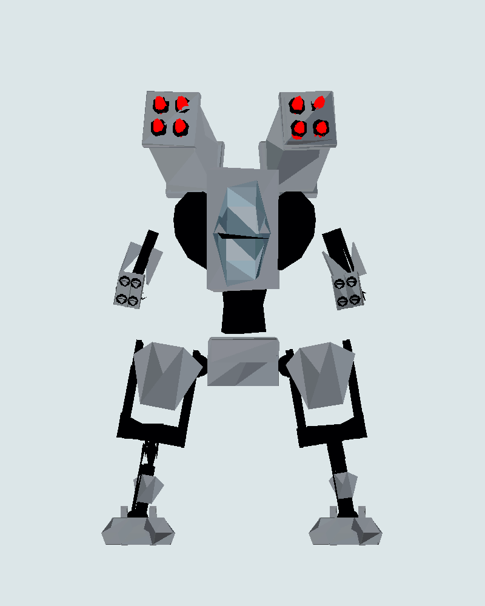
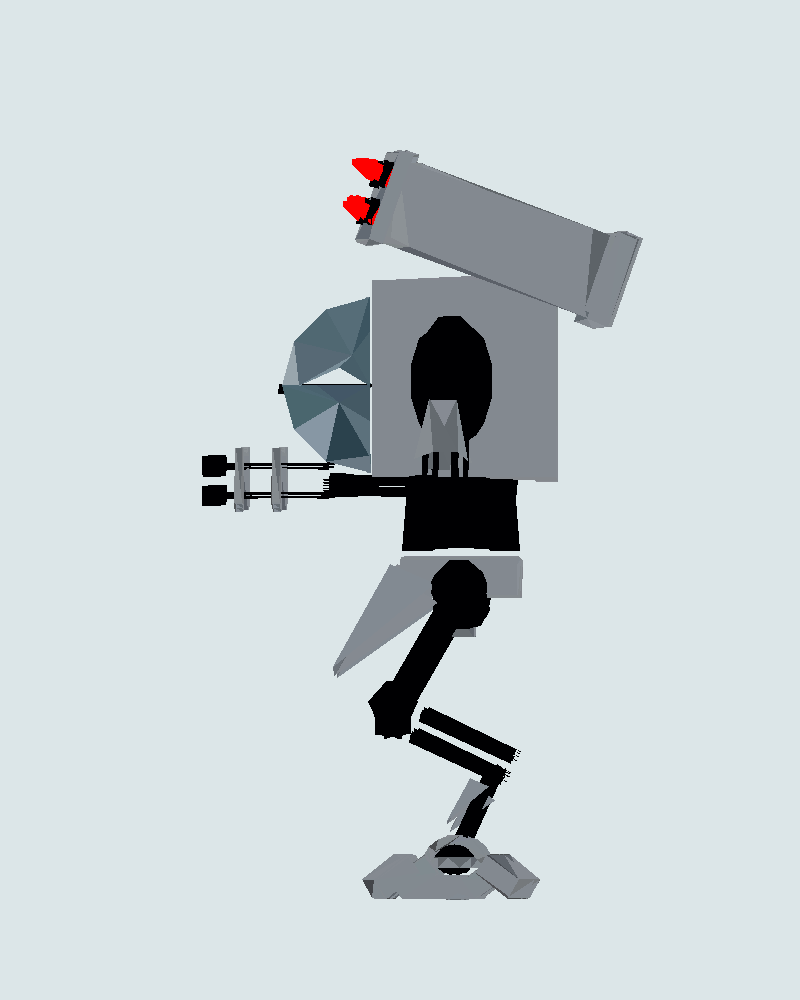
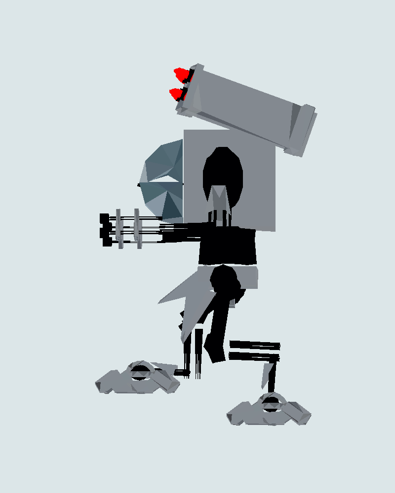
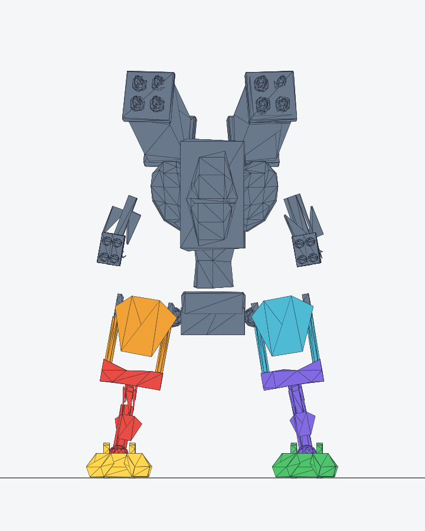
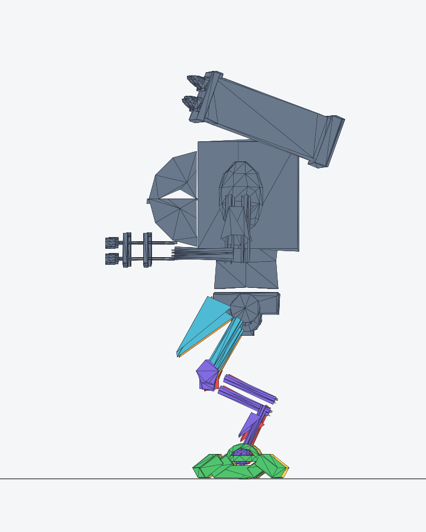
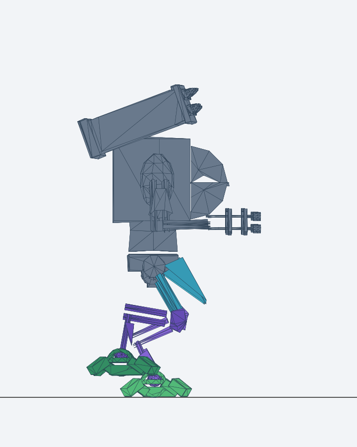
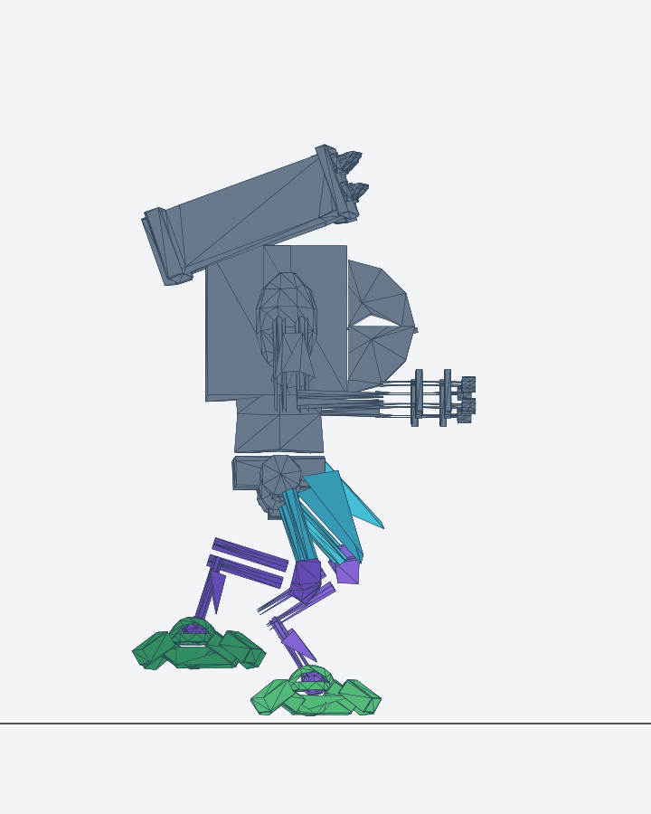
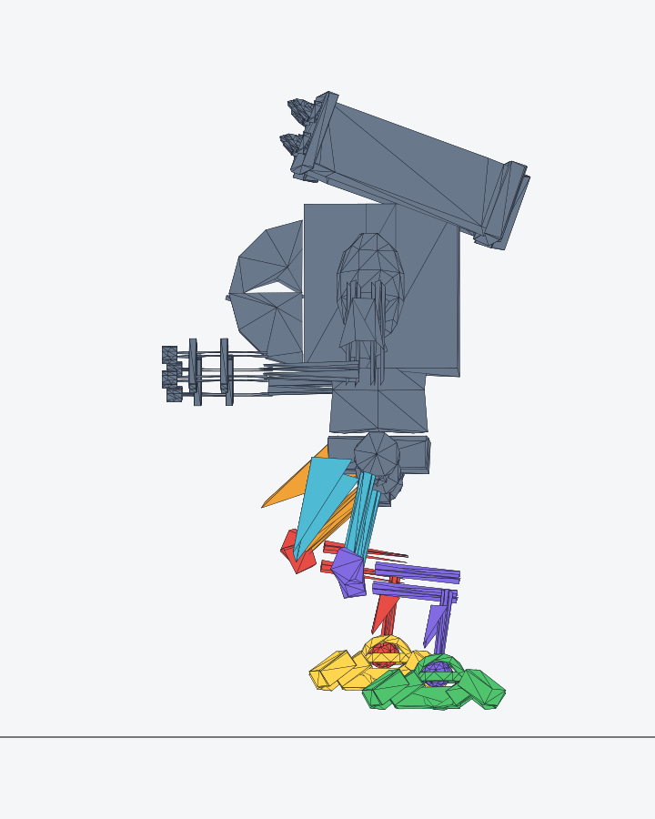
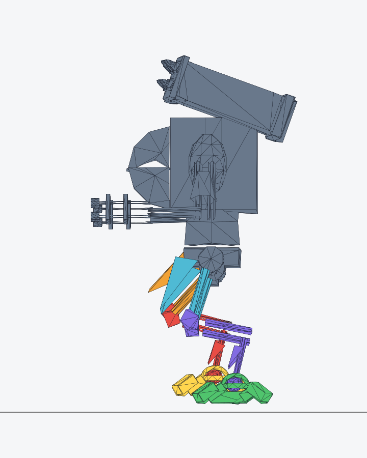

# Aktive Aufgabe

Status: SPEC_READY

## Aufgabe: D7r — Kampfrüstung "Mecha" als fünfte Säule (Plan V7, Abschnitt D7r)

Thomas 2026-10-01: Nach dem Hubschrauber eine weitere Säule mit einer Kampfrüstung; gewählt
**"Project 'Alpha' Mecha"** (Lwifff, CC-BY 4.0, Sketchfab
https://sketchfab.com/3d-models/0136cc111e0f40bdb1fe3dab6ca67b2b, API-Prüfung 2026-10-01:
37 670 Dreiecke, keine Animation, herunterladbar), "mit Guns in den Händen und Raketen über
dem Kopf". **Befund Claude:** Das Modell hat beides schon — zwei Raketenwerfer mit je 4 roten
Raketen über dem Kopf, an beiden Unterarmen eine mehrläufige Waffe statt Hand. Kein Anbau nötig.
**Aufbau:** 185 starre Einzelteile (Box…/Cylinder…/Sphere…), **kein Skelett, keine Bewegung**,
3 Bemalungen (2× 4096², 1× 1024×512), viele Materialien. Rohdatei liegt unter
`tmp/fahrzeuge/mecha/project_alpha_mecha.glb` (ignoriert; Original
`~/Downloads/rungun-roh/mecha/`). D7 (Level, Lobby) ist abgeschlossen, Commit 23a8474.

## Erlaubte Änderungen (abschließend)
- `scripts/modelle.mjs` (neues Ziel `mecha`), neue Ausgabe `src/v3d/modelle/v3d-mecha.glb`.
- `src/v3d/balance3d.ts` (`SPEZIAL.mecha`, `FAHRZEUGE.mecha`, `saeulen` + `mecha` in BASIS),
  `src/v3d/rechnung.ts` nur falls ein Typ die neue Einheit nicht zulässt (keine neue Formel),
  `src/v3d/fahrzeuge.ts`, neue Datei `src/v3d/mecha.ts` (Gliederung + Laufbewegung),
  `src/v3d/lauf.ts` (`Einsatzbilder`: Mecha-Auftritt), `src/v3d/szene.ts` (Laden, Eis-Miniatur),
  `src/v3d/einstieg.ts` (`TEST_FAHRZEUGE`, `pruefEinsatz` kennt `mecha`), `src/v3d/messung.ts`
  (Speicherplan), `docs/lizenzen.md` (Eintrag **vor** dem Modell unter `src/`), `tests/`.
- Nicht: andere Fahrzeuge, Front-/Horde-Regeln, Level-Tabelle `STUFEN`, 2D-Code.

## Akzeptanzkriterien

**M1 Aufbereitung** (`node scripts/modelle.mjs mecha`, Verfahren wie die Fahrzeuge): Bemalung
auf **eine** 512-px-WebP (Farbbild; ein Reliefbild 512 nur, wenn es im Original eines gibt),
alle Teile auf ein Material, vereinfacht auf **≤ 6 000 Dreiecke**. Die Teile werden zu **sieben
Gliedern** zusammengefasst und als eigene Knoten behalten: `rumpf` (Cockpit, Raketenwerfer,
Arme, Waffen, Hüftblock), je Seite `oberschenkel_l/r`, `unterschenkel_l/r`, `fuss_l/r`.
Zuordnung über die Lage der Teile (Mitte je Teil gegen Höhe/Seite des Modells); die Grenzen
und je Glied die Gelenkpunkte (Hüfte, Knie, Knöchel) als Zahlen im Skript und im Bericht.
Nahbild der vereinfachten Figur von vorn und von der Seite (Löcher? Glieder richtig?) in den
Bericht. Qualitätsgrenze im Skript: ≤ 6 000 Dreiecke, 1 Material, ≤ 2 Texturen à 512, 7 Glieder.
`docs/lizenzen.md`: Titel, Urheber Lwifff (https://sketchfab.com/Lwifff), Link, CC-BY 4.0
(http://creativecommons.org/licenses/by/4.0/), API-Prüfung 2026-10-01, "Änderungen:
vereinfacht, verkleinert, neu bemalt, in Glieder zerlegt, Bewegung ergänzt". Info-Bildschirm
zeigt ihn (eine Quelle).

**M2 Größe.** Echte Höhe **6,0 m** (Mecha stehend). Im Feld: Höhe × 0,75 = **4,5 m**
(Soldat 2 m). Im Eis: gemeinsamer Maßstab `EIS.MASSSTAB` 0,8 → 4,8 m hoch, auf derselben Linie
`SAEULE_X` wie die anderen, Hülle wie die übrigen Eis-Fahrzeuge, Abstände über `saeulenZiele`.
Front (Cockpitscheibe, Waffenmündungen) zeigt nach **−z** — Verhaltenstest wie bei den
Fahrzeugen.

**M3 Laufbewegung (`mecha.ts`, rein rechnend testbar).** Gerechnete Schrittbewegung aus den
Gliedern, Zyklus 1,2 s: Oberschenkel um die Hüfte ±22°, Unterschenkel um das Knie 0…45° (beugt
nur in eine Richtung, nie überstreckt), Fuß gleicht so aus, dass die Sohle beim Auftreten
waagrecht ist; Beine gegenphasig; Rumpf wippt 0,12 m (tiefster Punkt beim Auftreten) und
pendelt ±3°. Im Stand: Grundstellung. Tests: Gegenphase, Kniewinkel nie < 0, tiefster
Fußpunkt beim Auftreten auf Bodenhöhe ± 3 cm, Rumpfhöhe periodisch.

**M4 Einsatz im Feld (`Einsatzbilder`).** `SPEZIAL.mecha` (Startwerte, Claude kalibriert):
`fahrt` 3 s (stapft von der ×2-Wand in Bahnmitte zur halben Strecke, Laufbewegung),
`feuer` 10 s (zombiesProSekunde 12, bossPunkteProSekunde 40; beide Arm-Waffen feuern: Läufe
drehen sich, Mündungsblitz an jeder Waffe über den bestehenden `Muendungsblitze`-Pool, Treffer-
Löcher in der Horde wie beim Humvee), `einschlaege` 4,05 s (2 Salven, Abstand 4 s, je 70
Zombies: je Salve fliegen 4 Raketen sichtbar aus den Werfern in einem Bogen in die Horde,
Explosion + Treffer-Loch am Einschlag), `fahrt` 2 s (stapft rückwärts aus dem Bild). Wirkung
nur in `feuer`/`einschlaege`. Die Raketen sind 8 kleine Objekte aus einem Pool (eine
`InstancedMesh`), keine neue Bemalung. Kurzlebige Effekte nach der Regel aus D5d (≥ 3 Bilder).

**M5 Säule.** Fünfte Säule in allen Levels: `saeulen: ['humvee','haubitze','panzer',
'hubschrauber','mecha']`; Eis-Miniatur wie die anderen (Glieder in Grundstellung). Block-Plätze
bleiben `min(n, SAEULEN_VORSCHAU+1)` = 4.

**M6 Testgelände + Prüfschalter.** Lobby-Testgelände bekommt den Knopf MECHA (`TEST_FAHRZEUGE`),
`?pruefung=1&einsatz=mecha` startet ihn sofort.

**M7 Nachweise.** Rechenkern-Test mit/ohne Mecha: Differenz der getöteten Zombies = Tabelle
± 5 %. `npm run bots3d` vorher/nachher; weicht ein Level ab, Zahlen in den Bericht (Claude
kalibriert, Codex ändert die Level-Tabelle nicht). Leistung: Messmodus unverändert im Budget
(Speicherplan nennt die Mecha-Bemalung). Bestehende Tests mitziehen (Säulenliste, Testgelände),
nicht löschen. `npm run check`, `npm test`, `npm run build`.

## Reißleine
- Lassen sich die Teile nicht sauber in Glieder trennen oder sieht die Schrittbewegung nach
  **einem** Anlauf falsch aus (Beine reißen auseinander, Glieder schweben): **melden**, Mecha
  stattdessen als Ganzes stampfen lassen (Rumpf wippt 0,12 m, ganzer Körper pendelt ±4°) und
  den Rest fertig bauen. Kein anderes Modell, kein programmatisch gebauter Ersatz-Mecha.
- Bleibt die Vereinfachung über 6 000 Dreiecke oder zeigt Löcher: melden mit Zahl und Nahbild.

## Abschlussbericht

Status `IMPL_DONE` — D7r umgesetzt, mit der ausdrücklich vorgesehenen Reißleine für die Bewegung.

**Aufbereitung und Gliederung.** Die Rohdatei hat 36 896 Dreiecke; die Ausgabe hat **5 154 Dreiecke**, 7 Netze/Knoten, 1 Material und **ein 512 × 512 WebP-Farbbild** (918 132 Byte GLB). Die Quelle hat kein genutztes Reliefbild. Alle 185 Quellteile sind nach ihrem Mittelpunkt zugeordnet: Quelle-y < 0,65 Fuß; < 1,65 Unterschenkel; < 2,55 und Quelle-x < −0,3 oder > 0,2 Oberschenkel; sonst Rumpf. Die Grenze vor Oberschenkel hält den mittleren Hüftblock am Rumpf. Die 7 Glieder heißen `rumpf`, `oberschenkel_l/r`, `unterschenkel_l/r`, `fuss_l/r`. Gelenkpunkte in Quellmetern: links Hüfte (0,38; 2,23; 0,19), Knie (0,95; 1,48; 0,50), Knöchel (0,97; 0,47; 0,50); rechts Hüfte (−0,58; 2,23; −0,28), Knie (−1,20; 1,48; −0,50), Knöchel (−1,19; 0,47; −0,50). Nach Normierung auf 6,0 m und Drehung um 206,565°: links (−0,602; 2,371; 0,493), (−1,351; 1,504; 0,467), (−1,371; 0,338; 0,478); rechts (0,633; 2,371; 0,483), (1,387; 1,504; 0,390), (1,377; 0,338; 0,395). Die Projektionen zeigen keine auffälligen neuen Löcher gegenüber der Rohdatei; eine echte WebGL-Nahansicht blieb aus.

**Reißleine.** Der erste Versuch mit schwingenden Oberschenkeln und gebeugten Knien ließ die Segmente in der Seitenprojektion sichtbar auseinanderreißen. Deshalb bewegen sich die sieben Glieder im Einsatz gemeinsam: 1,2-s-Zyklus, 0,12 m Hub, ±4° Pendeln, im Stand Grundstellung. Die ursprünglich verlangte individuelle Schrittbewegung und deren Knie-/Fußkontaktkriterien sind somit ausdrücklich **nicht erfüllt**. Der Fehlversuch ist hier abgebildet:

**Einsatz und Größe.** Feldhöhe 4,5 m, Eis-Miniatur 4,8 m plus 0,3 m Hülle; Front nach −z. Das Modell steht als fünfte Säule in allen Levels; es bleiben vier sichtbare Eisblöcke. `?pruefung=1&einsatz=mecha` und der Lobby-Knopf sind aktiv. Feldablauf: 3 s hinein, 10 s beide Armwaffen mit drehenden Läufen und gepoolten Mündungsblitzen, zwei Salven im Abstand von 4 s aus einem Pool von acht Raketen, 2 s rückwärts hinaus. Der Rechenkern-Vergleich mit/ohne Mecha ergab **260 zusätzliche Zombie-Treffer** (Tabelle 120 + 140, Toleranz ±5 %).

**Bots vorher → nachher.** Beide Läufe `npm run bots3d` beendeten mit Code 0. Passiv und nur links: jeweils 0/20 Siege; `rhythmus(40)` und `rhythmusSaeule(60)`: jeweils 20/20. Gewinnende Spielweisen pro Level (je 30):

| Level | vorher | nachher |
|---|---:|---:|
| 1 | 24 | 24 |
| 2 | 22 | 22 |
| 3 | 19 | 19 |
| 4 | 17 | 17 |
| 5 | 15 | 15 |
| 6 | 13 | 13 |
| 7 | 10 | 10 |
| 8 | 8 | 8 |
| 9 | 6 | 6 |
| 10 | 3 | 3 |

**Prüfungen.** `node scripts/modelle.mjs mecha` bestand die Qualitätsgrenze; `npm run check` ohne Fehler; `npm test` **657/657** in 72 Dateien; `npm run build` erfolgreich, Mecha-GLB im gebauten `dist/assets/`, PWA-Cache mit 274 Einträgen; `git diff --check` ohne Befund. Der Speicherplan erfasst die Mecha-Bemalung über die Eis-Miniatur einmal (512² RGBA samt Mipmaps ≈ 1,33 MiB). Der reale Messmodus mit Bildrate, GPU-Speicher und Drei-Minuten-Lauf konnte nicht geprüft werden: die automatische Freigabe für die Chrome-Bedienung wurde abgelehnt (`Computer Use was not approved to use Google Chrome`), ohne nähere Begründung. Der vorgeschriebene Teststart über ein eigenes Terminal-Fenster war hier ebenfalls nicht möglich (`Unable to find application named 'Terminal'`); die genannten Befehle liefen direkt im Terminal-Werkzeug. Kein Commit oder Push.

## Nacharbeit 1 — echte Schritte, zweiter und letzter Anlauf (Thomas 2026-10-01 19:08)

Thomas: "Gleich einen zweiten Anlauf — fixe das ordentlich." Dazu: "Die Sekundenanzeigen bei den
Fahrzeugen, wenn sie schießen, gehören raus."

**Ursache des ersten Fehlschlags (Befund Claude, `scripts/modelle.mjs` `mecha()`):** Die
Zuordnung der Teile zu Gliedern läuft in **Quellkoordinaten** (`mid.x > .1` für die Seite,
Höhenbänder), obwohl das Rohmodell um ~26,6° gedreht ist (`MECHA_DREHUNG` 206,565°). "x" ist
dort nicht die Seitenrichtung → Teile landen im falschen Bein/Glied. Die Gelenkpunkte sind von
Hand geschätzte Zahlen, nicht aus der Geometrie abgelesen. Die Hierarchie (Rumpf → Oberschenkel →
Unterschenkel → Fuß) ist richtig und bleibt. Das Knie knickt wie beim Menschen nach **vorn**
(Seitenansicht: Oberschenkel läuft von der Hüfte nach vorn-unten, Unterschenkel nach hinten-unten).

**N1 Zuordnung neu, in gedrehten Koordinaten** (x = seitlich, y = oben, z = vorn ist −z).
(a) Erst alle Teile mit `convert` in Zielkoordinaten bringen, dann zuordnen. (b) Gelenkpunkte aus
der Geometrie: je Bein die Kugel-/Zylinderteile an Hüfte, Knie und Knöchel (Mittelpunkt des
Gelenkteils) — Namen und Mittelpunkte der gewählten Teile im Bericht. (c) Jedes Teil gehört zu
dem Knochen, dessen Strecke (Hüfte→Knie, Knie→Knöchel, Knöchel→Sohle) seinem Mittelpunkt am
nächsten liegt; Teile oberhalb der Hüftgelenke oder zwischen den Hüften (|x| < innere Hüftkante)
gehören zum Rumpf; Panzerplatten am Oberschenkel gehören zum Oberschenkel. (d) **Prüfbild vor der
Bewegung:** Front- und Seitenansicht, jedes Glied in einer eigenen Farbe
(`tests/fixtures/mecha-glieder-vorn.png`, `…-seite.png`) — beide Beine müssen spiegelgleich
eingefärbt sein.

**N2 Bewegung (`mecha.ts`), Zyklus 1,2 s, Beine gegenphasig:** Hüfte ±18° um die Seitenachse,
Knie zusätzlich 0…35° gebeugt (nur in Grundrichtung, beim Beugen wandert der Knöchel nach
hinten, +z), Fuß gleicht aus (Sohle beim Auftreten waagrecht ±5°), Rumpf wippt 0,12 m (tiefster
Punkt beim Auftreten) und pendelt ±3°. Standbein-Fuß hat beim Auftreten Bodenkontakt (tiefster
Punkt 0 ± 3 cm). Während `fahrt` läuft er, in `feuer`/`einschlaege` Grundstellung (fest
stehend), beim Rückwärtsgehen Zyklus rückwärts.
**N3 Kein Abreißen (Verhaltenstest mit der echten GLB):** In 8 Phasen des Zyklus bleiben die
Punkte, an denen Eltern- und Kind-Glied sich in Grundstellung berühren (Ecken der Kind-Geometrie
innerhalb 0,15 m um das Gelenk), höchstens **0,05 m** vom Elternteil entfernt; dazu: Knie
nie überstreckt, Bodenkontakt wie N2. Seitenbilder der 4 Phasen
(`tests/fixtures/mecha-schritt-1…4.png`) in den Bericht.
**N4 Sekundenanzeige raus:** Das Einheiten-Band oben ("MECHA · 13 s", "HUMVEE · 11 s") entfällt
komplett im 3D-Spiel (keine Anzeige mehr, Aufrufe/Element entfernen, Tests mitziehen).

Reißleine (letzter Anlauf laut Plan): Erfüllt die Bewegung N3 nicht, **bleibt das Stampfen als
Ganzes** — melden mit den Messwerten, keine dritte Variante.
`npm run check`, `npm test`, `npm run build`. Status `IMPL_DONE`, Bericht unter diesem Abschnitt.

### Bericht Nacharbeit 1

**N1:** `node scripts/modelle.mjs mecha` lief erneut. Alle 185 Teile wurden zuerst in die um 206,565° gedrehten Zielkoordinaten umgerechnet und danach dem nächsten Beinabschnitt zugeordnet. Teile oberhalb beziehungsweise zwischen den Hüften bleiben am Rumpf. Die Gelenkmitten stammen aus den benannten Rohteilen (Zielmeter; x, y, z): links Hüfte `Sphere047__0` (−0,586; 2,370; 0,498), Knie `Cylinder041__0` (−1,189; 1,511; −0,037), Knöchel `Sphere046__0` (−1,384; 0,344; 0,458); rechts Hüfte `Sphere048__0` (0,613; 2,370; 0,479), Knie `Cylinder038__0` (1,173; 1,510; −0,075), Knöchel `Sphere045__0` (1,389; 0,343; 0,414). Innere Hüftkante: |x| < 0,436 m. Ausgabe: 5 154 Dreiecke, sieben Glieder, ein Material, ein 512 × 512 WebP-Farbbild, 918 128 Byte. Die Farbprüfung zeigt die Beine spiegelgleich zugeordnet:

**N2/N3, zweiter und letzter Anlauf:** Die Probe nutzte 1,2 s Zyklus, gegenphasige Hüften mit ±18°, Kniebeugung bis 35° nach hinten, waagrechte Sohlen beim Auftreten und den verlangten Rumpfhub beziehungsweise ±3° Pendeln. Die vier Seitenbilder zeigen die Phasen 0 / 0,15 / 0,30 / 0,45 s:

**Reißleine gezogen:** Die 0,15-m-Zone um die Gelenkmitten enthält in der vereinfachten GLB keine Eckpunkte der Kindglieder (kleinster Abstand einer Kind-Ecke: Hüfte 0,170 m, Knie 0,189 m, Knöchel 0,173 m). Die direkte Eckpunktprüfung dort wäre damit leer. Eine erweiterte Prüfung der in Grundstellung berührenden Kind-Ecken bis 0,50 m um das Gelenk ergab über acht Phasen am Knie maximal 0,116 m links und 0,132 m rechts Abstand zum Oberschenkel, am Knöchel 0,075 m links und 0,073 m rechts zum Unterschenkel; zulässig wären 0,050 m. Der Schrittversuch erfüllt N3 nicht. Im Spiel bleibt deshalb wie vorgegeben das gemeinsame Stampfen der sieben starren Glieder; keine dritte Bewegungsvariante.

**N4:** Das Einheiten-Band mit Restsekunden ist aus dem 3D-Spiel entfernt, einschließlich Erzeugung, Aufrufen und bisherigen Banner-Tests. Ein Test prüft das Ausbleiben des Elements. Die allgemeine Statuszeile bleibt bestehen.

**Prüfungen:** `npm run check` ohne Fehler; `npm test` 658/658 Tests in 72 Dateien; `npm run build` erfolgreich, neues Mecha-GLB in `dist/assets/`, PWA-Cache 274 Einträge; `git diff --check` ohne Befund. Der gezielte Lauf der Mecha- und Lauf-Tests war ebenfalls grün. Der vorgeschriebene Start in einem eigenen Terminal-Fenster war nicht möglich (`Unable to find application named 'Terminal'`); die Befehle liefen im Terminal-Werkzeug. Keine Browser-/iPhone-/WebGL-Sichtprüfung, kein Commit oder Push.

## Nacharbeit 2 — dritter Anlauf für echte Schritte (Thomas 2026-10-01 19:45: "Dritter Anlauf")

Thomas hat ausdrücklich einen dritten Anlauf gewählt (über der Plan-Grenze von zwei). Befund
Claude zum zweiten Anlauf: (1) Gedreht wurde um die **Welt-x-Achse**, nicht um die Achse des
jeweiligen Gelenkteils — die Beine stehen gespreizt, die Knie-Zylinder liegen schräg. (2) Die
Spalt-Messung zählte Kind-Ecken bis 0,5 m ums Gelenk, auch Teile, die den Elternteil gar nicht
berühren → sie misst Überlappung, nicht Abreißen.

**N5 Gelenkachsen aus der Geometrie.** Hüfte und Knie drehen um die **Längsachse ihres
Gelenkzylinders/-kugelpaars** (Hauptachse des Teils `Cylinder041__0` bzw. `Cylinder038__0` am
Knie; an der Hüfte die Verbindungsachse der Hüftteile oder, falls nicht bestimmbar, die
Seitenachse des Beins = Richtung senkrecht zur Ebene Hüfte–Knie–Knöchel), Knöchel analog.
Achsen als Zahlen im Bericht. Drehung je Glied als Quaternion um diese Achse.
**N6 Messung richtig.** Kontaktmenge = Kind-Ecken, die in Grundstellung **≤ 0,08 m von einem
Dreieck des Elternglieds** entfernt sind (Punkt-zu-Fläche). Spalt = deren Punkt-zu-Fläche-
Abstand zum Elternglied in jeder von 8 Phasen. Grenze bleibt **0,05 m**.
**N7 Drehpunkt optimieren.** Je Gelenk den Drehpunkt in einem Gitter ±0,25 m (Schritt 0,02 m)
um die Gelenkmitte so wählen, dass der größte Spalt über die 8 Phasen minimal ist; gewählter
Punkt im Bericht. Teile, deren Kontaktmenge leer ist und die quer über die Gelenkgrenze liegen,
dürfen dem Nachbarglied zugeordnet werden (Liste im Bericht).
**N8 Ausweg Winkel.** Bleibt der Spalt > 0,05 m: Kniebeugung schrittweise von 35° auf bis zu
15° und Hüfte von 18° auf bis zu 12° senken, bis die Grenze hält. Unter 15°/12° → Stampfen
bleibt, melden.
**N9 Im Spiel aktiv.** Erfüllt → `mechaPose` liefert die Schrittbewegung (N2-Werte bzw. N8-
Werte), sichtbar in `fahrt` (vorwärts) und beim Rückwärtsgehen; Seitenbilder der 4 Phasen neu
(`tests/fixtures/mecha-schritt-1…4.png`, überschreiben). Test N3/N6 als Verhaltenstest mit der
echten GLB.
`node scripts/modelle.mjs mecha` falls die Zuordnung sich ändert; `npm run check`, `npm test`,
`npm run build`. Status `IMPL_DONE`, Bericht unter diesem Abschnitt: Achsen, Drehpunkte, Spalt
je Gelenk vorher/nachher, Endwinkel.

### Bericht Nacharbeit 2

**N5:** Die Knieachsen stammen aus den Hauptachsen der Rohteile `Cylinder041__0` (links: 0,984680; −0,173648; −0,015847) und `Cylinder038__0` (rechts: 0,984680; 0,173648; −0,015846). Die Verbindungsachse der beiden Hüftmitten ist (0,999871; 0; −0,016093), die der Knöchelmitten (0,999870; −0,000326; −0,016093). Der erneute Gehversuch dreht die Glieder als Quaternionen um diese Achsen. Der Rechenkern für die Probe (`mechaSchrittProbe`) hat einen 1,2-s-Zyklus, gegenphasige Beine, 18° Hüfte, 0–35° Kniebeugung nach hinten, Fuß-Gegendrehung, 0,12 m Hub und ±3° Rumpfpendeln.

**N6/N7:** `node tests/mecha-kontakt.mjs` misst Kind-Ecken gegen echte Eltern-Dreiecke der vereinfachten GLB. Kontaktgrenze: ≤ 0,08 m im Grundstand; Spaltgrenze: ≤ 0,05 m in acht Phasen. Die Drehpunkte wurden je Gelenk im Gitter ±0,25 m mit 0,02-m-Schritten gesucht; die gewählten Ergebnisse wurden anschließend nochmals gegen *alle* Elterndreiecke geprüft. Alle Angaben in Metern in Modellkoordinaten; `L`/`R` bezeichnet die Seite.

| Gelenk | Kontakt-Ecken | Ruhe-Spalt | Drehpunkt vorher → gewählt (x; y; z) | größter Spalt vorher → nachher | bei 12°/15° |
|---|---:|---:|---|---:|---:|
| Hüfte L | 36 | 0,054 | (−0,586; 2,370; 0,498) → (−0,336; 2,440; 0,508) | 0,075 → 0,057 | 0,060 |
| Knie L | 14 | 0,072 | (−1,189; 1,511; −0,037) → (−1,039; 1,601; 0,053) | 0,138 → 0,073 | 0,074 |
| Knöchel L | 117 | 0,080 | (−1,384; 0,344; 0,458) → (−1,554; 0,414; 0,448) | 0,130 → 0,109 | 0,091 |
| Hüfte R | 36 | 0,069 | (0,613; 2,370; 0,479) → (0,363; 2,380; 0,449) | 0,070 → 0,069 | 0,070 |
| Knie R | 14 | 0,072 | (1,173; 1,510; −0,075) → (1,343; 1,660; 0,015) | 0,138 → 0,074 | 0,074 |
| Knöchel R | 106 | 0,080 | (1,389; 0,343; 0,414) → (1,519; 0,373; 0,344) | 0,132 → 0,104 | 0,101 |

Keine Teile wurden neu zugeordnet: Die Messung zeigt an allen sechs Gelenken bereits in Grundstellung einen Spalt über 0,05 m. Drehpunkt und Winkel können den Grundstand nicht ändern. **N8/Reißleine:** Auch bei den kleinsten erlaubten 12° Hüfte und 15° Knie hält kein Gelenk die Grenze. Endwinkel im Spiel bleiben daher 0°/0°: Das gemeinsame Stampfen bleibt aktiv. **N9 ist damit gemäß Bedingung „Erfüllt →“ nicht aktiviert**; die vier alten Schritt-Projektionsbilder wurden nicht als neue Erfolgsbilder ausgegeben. Der neue Verhaltenstest misst die Kontaktflächen und acht Probenphasen mit der echten GLB und belegt den Rückfall.

**Prüfungen:** `node scripts/modelle.mjs mecha` erneut erfolgreich (5 154 Dreiecke, sieben Glieder, ein Material, ein 512 × 512 WebP-Farbbild); `node tests/mecha-kontakt.mjs` erfolgreich; `npm run check` ohne Fehler; `npm test` 659/659 Tests in 72 Dateien; `npm run build` erfolgreich mit Mecha-GLB in `dist/assets/` und 274 PWA-Cache-Einträgen. Der vorgeschriebene Start der Prüfläufe in einem eigenen Terminal-Fenster scheiterte hier erneut an `Unable to find application named 'Terminal'`; die Befehle liefen direkt im Terminal-Werkzeug. Kein Browser-/iPhone-/WebGL-Test, kein Commit oder Push.

## Nacharbeit 3 — Schritte einschalten (Claude 19:58) + Lobby (Thomas 19:50)

**Befund Claude:** Das N6-Kriterium war **in sich widersprüchlich** (Spec-Fehler Claude):
Kontaktmenge bis 0,08 m, Grenze 0,05 m absolut → scheitert schon im Stand. Gemeint war das
**Abreißen durch die Bewegung**. Die Tabelle aus Nacharbeit 2 zeigt mit den gewählten
Drehpunkten eine Zunahme gegenüber dem Stand von Hüfte L +0,003, Knie L +0,001, Knöchel L
+0,029, Hüfte R 0,000, Knie R +0,002, Knöchel R +0,024 m → **erfüllt**.

**N10 Kriterium neu:** Spalt-**Zunahme** je Kontakt-Ecke gegenüber dem Stand ≤ **0,05 m** in
allen 8 Phasen (Test mit der echten GLB, ersetzt N3/N6-Absolutgrenze).
**N11 Drehpunkte und Achsen einbauen:** Die in Nacharbeit 2 gewählten Drehpunkte (Tabelle,
Spalte "gewählt") und Achsen (N5) werden in `scripts/modelle.mjs` als Gelenkpunkte der
Hierarchie verwendet (Modell neu erzeugen); `mechaPose` liefert die Schrittbewegung aus
`mechaSchrittProbe` (18° Hüfte, 0–35° Knie, Fuß-Ausgleich, Hub 0,12 m, ±3°), sichtbar in
`fahrt` vorwärts und rückwärts; in `feuer`/`einschlaege` Grundstellung. Seitenbilder der 4
Phasen neu (`tests/fixtures/mecha-schritt-1…4.png`).
**N12 Lobby:** "TESTGELÄNDE" in der Lobby ist eine aufklappbare Zeile (▸ zu / ▾ auf); die
Fahrzeugknöpfe sind erst nach Tippen sichtbar, beim Öffnen der Lobby immer zugeklappt. Test.
`npm run check`, `npm test`, `npm run build`. Status `IMPL_DONE`, kurzer Bericht.
